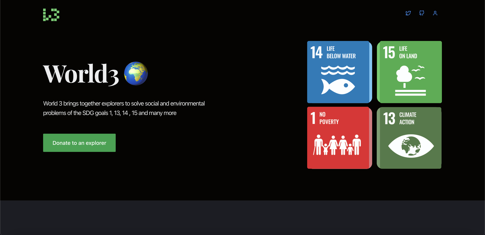
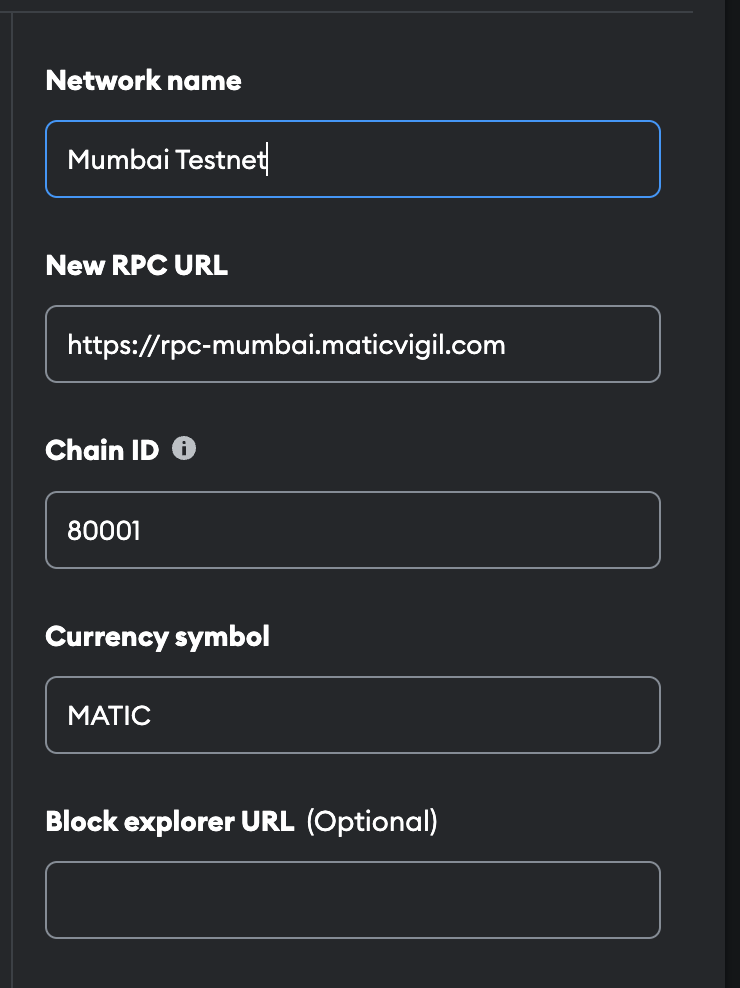

<p align="center">
  <a href="https://github.com/king-technologies/Project-Initiator" title="Project Initiator">
    
  </a>
</p>
<h1 align="center"> World3-SDG for Gitcoin Storage Wizard</h1>

<p align="center" title="Project Initiator"></p>

##  Motivation

 I used to wonder by virtue of what long the dust has experienced, by what method beings submerged remain, reason mammals obsolesce, and what causes rain to fall. When I begun grades 8-12, I fulfilled that most of the answers I was expect were right beyond me. Our conduct have a meaningful affect our experience. How can we address these concerns? Individuals must sanctify themselves as trailblazers to assist in the administration of these tangible and social issues.

## IPFS/Web3Storage Implementaion 
 
World 3 platform is based on ethereum, IPFS and Web3Storage which stores files and data which user generates by setting up project and profile information. These    details later used in managing social issues. Project created by user will be further aimed for getting sponsorship from people all over the world, which eventually helping SDG's to get achieved in upcoming years.

- **Create Project-** https://github.com/imdivyanshusingh/World3-SDG/blob/main/src/components/CreateProject.js
- **Edit Profile-** https://github.com/imdivyanshusingh/World3-SDG/blob/main/src/components/EditProfile.js
 
## Sustainable Development Goals- SDG's

The Sustainable Development Goals or Global Goals are a collection of 17 interlinked global goals designed to be a "shared blueprint for peace and prosperity for people and the planet, now and into the future". The SDGs were set up in 2015 by the United Nations General Assembly and are intended to be achieved by 2030.

##  How it works

World 3 is a web 3.0 platform that will bring together explorers to solve social and environmental problems of the SDG goals. Our mission is to use blockchain to achieve real world impact, especially in areas where there is no other solution. We believe that the technology exists today, and more importantly, we have built World3 to be easily adopted by anyone that needs a tool for managing social issues.

Follow the steps below to get started with web3.

- **Click on the profile icon at the top right corner of the homepage**

- **Setup a your profile**

- **Setup a project.**

- **Get Sponsorship from user all over the world**

## Prerequisite

- [Nodejs](https://nodejs.org/en// "Node") Installed

- [Git](https://git-scm.com/ "Git OFficial") Installed

- [npm](https://www.npmjs.com/ "npm ") Installed

- [Hardhat](https://hardhat.org/ "Hardhat ") Installed

## 🛠️ Installation Steps

1. Clone the repository

```Bash
git clone https://github.com/imdivyanshusingh/world3-SDG
```

2. Change the working directory

```Bash
cd world3-SDG
```

3. Start the local Hardhat node

```Bash
npx hardhat node
```

4. With the network running, deploy the contracts to the local network in a separate terminal window

```Bash
npx hardhat run scripts/deploy.js --network localhost
```

5. Start the app

```Bash
npm run start
```

**🎇 You are Ready to Go!**

## ⚙️ Configuration

The chain ID should be 80001. If you have a localhost rpc set up, you may need to overwrite it.

<p align="center" title="Project Initiator"></p>

To deploy to Polygon test or main networks, update the configurations located in hardhat.config.js to use a private key and, optionally, deploy to a private RPC like Infura.

```Bash
require('@nomiclabs/hardhat-waffle');
const privateKey = 'xx';
const projectId = 'xx';

module.exports = {
  defaultNetwork: 'hardhat',
  networks: {
    hardhat: {
      chainId: 1337,
    },
    matic: {
      url: 'https://polygon-mumbai.g.alchemy.com/v2/{projectId}',
      accounts: [privateKey],
    },
  },
  solidity: {
    version: '0.8.4',
    settings: {
      optimizer: {
        enabled: true,
        runs: 200,
      },
    },
  },
};
```

## 👷 Built with

- [Solidity](https://docs.soliditylang.org/en/v0.8.17/ "Solidity"): as Main Coding Language for writing smart contract

- [ReactJs](https://reactjs.org/ "React Js"): as Main Coding Language for Creating The UI components (Front End)

- [TailwindCss](https://tailwindcss.com/ "Tailwind Css"): as Main Coding Language for styling UI components

- [IPFS](https://ipfs.tech/ "IPFS"): For Storing of files

- [Web3 Storage](https://www.google.com/search?q=web3storage "Web3 Storage"): For Storing of files

## 📂 Contributing

Contributions are what make the open source community such an amazing place to learn, inspire, and create. Any contributions you make are greatly appreciated.

If you have a suggestion that would make this better, please fork the repo and create a pull request. You can also simply open an issue with the tag "enhancement". Don't forget to give the project a star! Thanks again!

- Fork the Project

- Create your Feature Branch (git checkout -b feature/AmazingFeature)

- Commit your Changes (git commit -m 'Add some AmazingFeature')

- Push to the Branch (git push origin feature/AmazingFeature)

- Open a Pull Request

## 🎊 Future Updates

- [ ] Mint memories as an NFT for explorers

- [ ] A mapping algorithm that displays explorers close to your location
